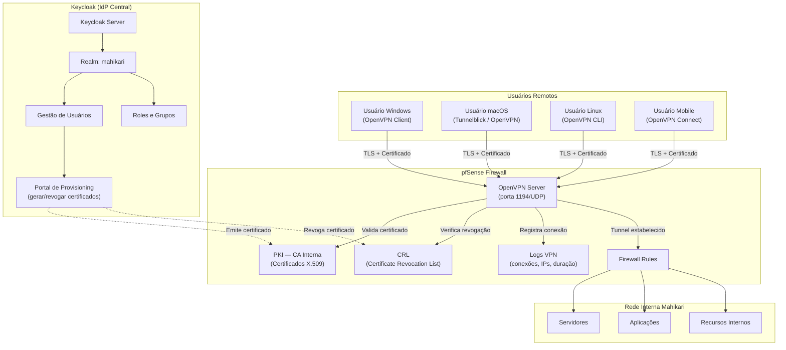
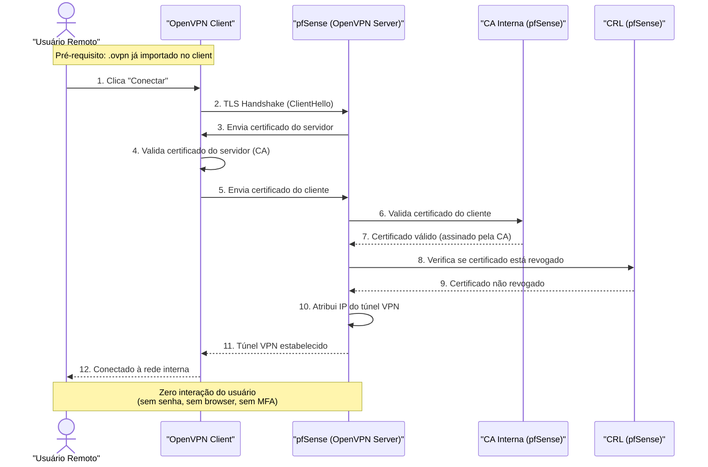
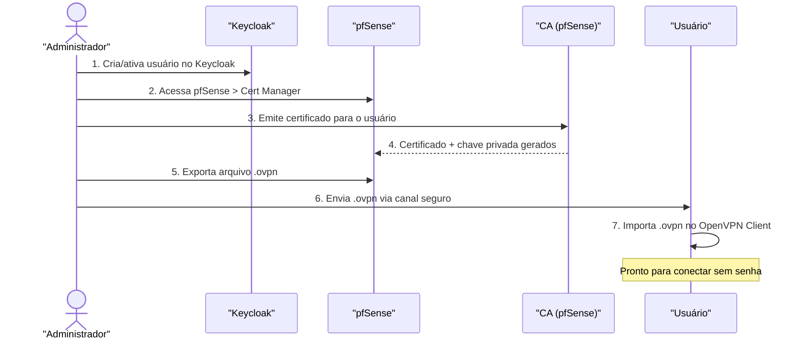
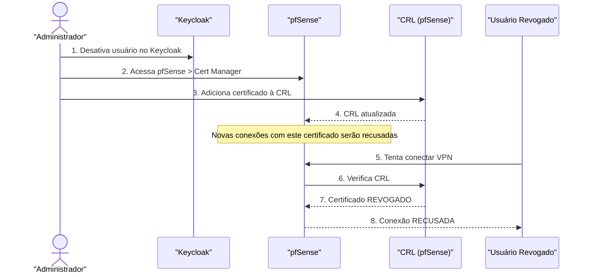
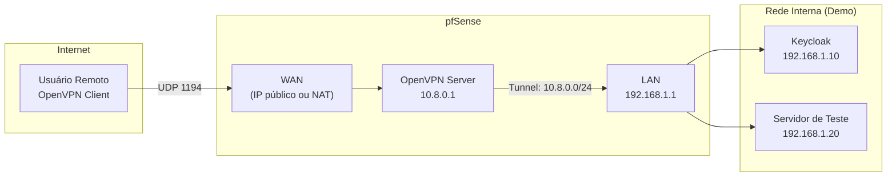

# Arquitetura — VPN sem Senha com pfSense + OpenVPN + Keycloak

**Mahikari**  
Versão: 2026-05-23

---

## 1. Visão Geral

A solução substitui o firewall Aker (Secure Roaming) por pfSense com OpenVPN, utilizando certificados digitais X.509 para autenticação sem senha. O Keycloak atua como Identity Provider central para gestão de identidades e ciclo de vida dos certificados.

---

## 2. Diagrama de Componentes

---

## 3. Fluxo de Conexão VPN (sem senha)

---

## 4. Fluxo de Provisioning de Certificado

---

## 5. Fluxo de Revogação de Certificado

---

## 6. Componentes da Arquitetura

### 6.1. pfSense — Firewall + VPN

| Item | Detalhe |
|---|---|
| Função | Firewall (stateful) + Servidor OpenVPN + PKI |
| Versão recomendada | pfSense CE 2.7+ |
| Instalação | Bare metal ou VM (mínimo 2 interfaces: WAN + LAN) |
| Portas | WAN: 1194/UDP (OpenVPN); 443/TCP (WebGUI admin) |
| PKI | CA interna para emissão de certificados X.509 |
| CRL | Certificate Revocation List para revogação imediata |
| Logs | Conexões VPN, IPs atribuídos, duração, bytes transferidos |

### 6.2. OpenVPN Server

| Item | Detalhe |
|---|---|
| Modo | Remote Access (SSL/TLS) |
| Protocolo | UDP, porta 1194 |
| Autenticação | **Certificado digital apenas** (sem user/pass) |
| Criptografia | AES-256-GCM |
| Hash | SHA256 |
| TLS Auth | tls-crypt (chave estática adicional) |
| Topologia | subnet (cada cliente recebe IP fixo do túnel) |
| Tunnel Network | 10.8.0.0/24 (configurável) |
| DNS push | DNS interno da Mahikari |
| Redirect gateway | Opcional (full tunnel ou split tunnel) |

### 6.3. PKI — Infraestrutura de Chave Pública

| Item | Detalhe |
|---|---|
| CA | CA raiz interna do pfSense (RSA 4096 bits, validade 10 anos) |
| Certificado do servidor | Emitido pela CA, tipo Server (validade 2 anos) |
| Certificado do cliente | Emitido pela CA, tipo User (validade 1 ano, renovável) |
| CRL | Atualizada automaticamente quando certificado é revogado |
| Algoritmo | RSA 4096 ou ECDSA P-384 |

### 6.4. Keycloak — Identity Provider

| Item | Detalhe |
|---|---|
| Função | Gestão centralizada de identidades |
| Realm | `mahikari` |
| Grupos | `vpn-users`, `vpn-admins` |
| Roles | `vpn-full-access`, `vpn-restricted`, `vpn-admin` |
| Integração | Portal web para provisioning de certificados VPN |
| Auditoria | Logs de criação/desativação de usuários |

### 6.5. OpenVPN Client

| Item | Detalhe |
|---|---|
| Windows | OpenVPN GUI ou OpenVPN Connect |
| macOS | Tunnelblick ou OpenVPN Connect |
| Linux | openvpn CLI ou NetworkManager |
| Android/iOS | OpenVPN Connect (app oficial) |
| Configuração | Arquivo `.ovpn` com CA cert, client cert, client key, tls-crypt |

---

## 7. Segurança

### 7.1. Proteção da chave privada

- A chave privada do certificado do cliente é armazenada no dispositivo do usuário
- No Windows: protegida pelo Windows Credential Store
- No macOS: protegida pelo Keychain
- No Linux: protegida por permissões de arquivo (chmod 600)
- **A chave privada nunca trafega pela rede** — apenas o certificado público é enviado durante o TLS handshake

### 7.2. TLS-Crypt

- Camada adicional de proteção: chave estática compartilhada (pré-shared)
- Criptografa e autentica o canal de controle do OpenVPN
- Protege contra ataques de fingerprinting e DoS no servidor VPN
- Incluída no arquivo `.ovpn`

### 7.3. Revogação

- Certificados revogados são adicionados à CRL no pfSense
- O OpenVPN Server verifica a CRL a cada nova conexão
- Revogação é **imediata para novas conexões**
- Conexões ativas não são desconectadas automaticamente (kill manual se necessário)

### 7.4. Validade dos certificados

- Certificados de cliente com validade de 1 ano (renovação anual)
- Renovação: emitir novo certificado → distribuir novo `.ovpn` → revogar antigo
- Processo de renovação gerenciado via Keycloak (tracking de validade)

---

## 8. Topologia de Rede da Demo

---

## 9. Comparação com o Aker Secure Roaming

| Aspecto | Aker Secure Roaming | pfSense + OpenVPN + Certificados |
|---|---|---|
| Experiência do usuário | Clique para conectar (sem senha) | **Clique para conectar (sem senha)** |
| Método de autenticação | Credenciais pré-provisionadas | Certificado digital X.509 |
| Protocolo VPN | Proprietário (Aker) | OpenVPN (open-source, padrão aberto) |
| Revogação de acesso | Via console do Aker | CRL no pfSense |
| Multiplataforma | Client Aker (limitado) | OpenVPN Client (todos os SO) |
| Auditoria | Logs do Aker | Logs do pfSense + Keycloak |
| Custo | Licença proprietária | **Gratuito** (open-source) |
| Suporte | Descontinuado | Comunidade ativa + Netgate (comercial) |
