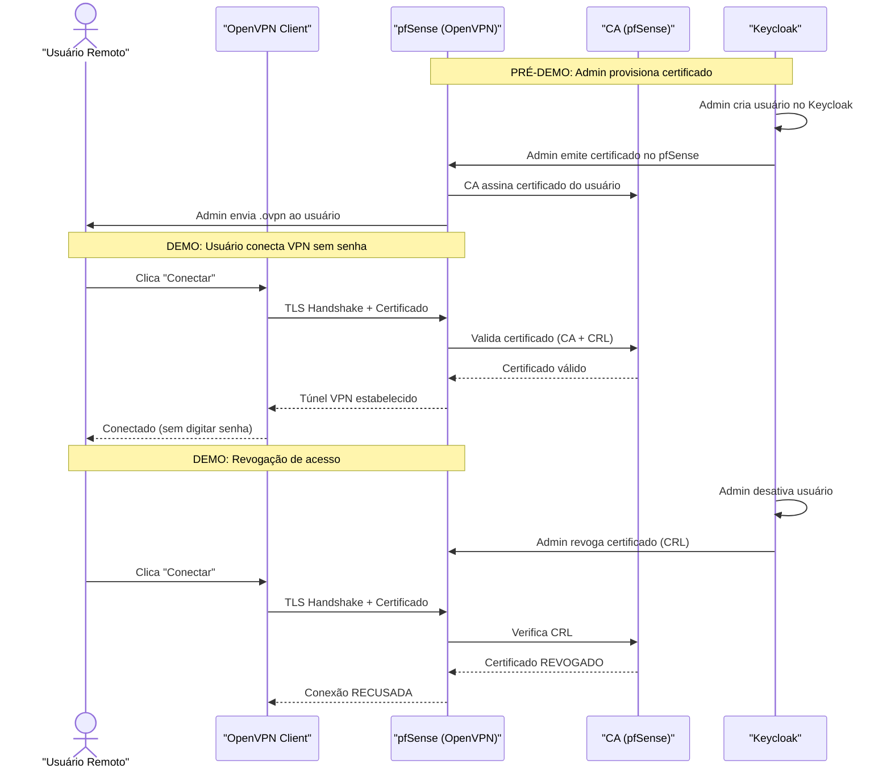

# Plano de Atividades — Demo VPN sem Senha (pfSense + Keycloak)

**Mahikari**  
Versão: 2026-05-23

---

## Objetivo da Demo

Demonstrar o fluxo completo de um **usuário remoto fechando VPN sem digitar senha**, utilizando pfSense + OpenVPN + certificados digitais, validando:

- Conexão VPN sem senha (certificado digital)
- Emissão de certificados pela CA interna do pfSense
- Revogação de certificado e bloqueio imediato de acesso
- Gestão de identidades no Keycloak

---

## Pré-requisitos da Demo

| Item | Detalhe |
|---|---|
| Servidor/VM para pfSense | Mínimo 2 interfaces de rede (WAN + LAN), 2 GB RAM, 20 GB disco |
| Servidor para Keycloak | Docker instalado, 2 GB RAM |
| Máquina cliente (teste) | Windows, macOS ou Linux com OpenVPN client |
| Acesso à internet | Para download de ISOs e pacotes |
| IP público ou NAT | Para o pfSense receber conexões VPN da internet |

---

## Fases da Demo

### Fase 1 — Instalação do pfSense

**Objetivo:** pfSense operacional com interfaces WAN e LAN configuradas.

**Procedimento:** [pfsense/procedimento-pfsense.md](../pfsense/procedimento-pfsense.md)

#### Atividades

1.1. Download da ISO do pfSense CE (Community Edition)

1.2. Instalar pfSense em VM ou bare metal
   - Interface WAN: DHCP ou IP estático (acesso à internet)
   - Interface LAN: IP estático (ex.: 192.168.1.1/24)

1.3. Acessar WebGUI do pfSense (https://192.168.1.1)

1.4. Executar o wizard inicial de configuração

1.5. Validar conectividade WAN (ping para internet)

#### Critério de conclusão
- [ ] pfSense acessível via WebGUI
- [ ] WAN com acesso à internet
- [ ] LAN configurada e funcional

---

### Fase 2 — Configuração da PKI (CA + Certificados)

**Objetivo:** CA interna criada, certificado do servidor OpenVPN emitido.

**Procedimento:** [pfsense/pki-certificados.md](../pfsense/pki-certificados.md)

#### Atividades

2.1. Criar CA interna no pfSense (System > Cert. Manager > CAs)
   - Nome: `Mahikari-VPN-CA`
   - Tipo: RSA 4096 bits
   - Validade: 10 anos

2.2. Criar certificado do servidor OpenVPN (System > Cert. Manager > Certificates)
   - Tipo: Server Certificate
   - CA: `Mahikari-VPN-CA`
   - Nome: `vpn-server`
   - Validade: 2 anos

2.3. Criar CRL (Certificate Revocation List)
   - Associar à CA `Mahikari-VPN-CA`

2.4. Criar certificado de teste para o primeiro usuário
   - Tipo: User Certificate
   - Nome: `usuario-teste-01`
   - Validade: 1 ano

#### Critério de conclusão
- [ ] CA `Mahikari-VPN-CA` criada
- [ ] Certificado do servidor `vpn-server` emitido
- [ ] CRL criada e vazia
- [ ] Certificado `usuario-teste-01` emitido

---

### Fase 3 — Configuração do Servidor OpenVPN

**Objetivo:** Servidor OpenVPN ativo no pfSense, escutando na porta 1194/UDP, autenticação apenas por certificado.

**Procedimento:** [pfsense/openvpn-server.md](../pfsense/openvpn-server.md)

#### Atividades

3.1. Criar servidor OpenVPN (VPN > OpenVPN > Servers > Add)

| Parâmetro | Valor |
|---|---|
| Server mode | Remote Access (SSL/TLS) |
| Backend for authentication | **Local Database** (sem RADIUS/LDAP — apenas certificado) |
| Protocol | UDP on IPv4 only |
| Interface | WAN |
| Local port | 1194 |
| TLS Configuration | TLS-Crypt (gerar chave automática) |
| Peer Certificate Authority | `Mahikari-VPN-CA` |
| Server certificate | `vpn-server` |
| DH Parameter Length | ECDH Only |
| Encryption Algorithm | AES-256-GCM |
| Auth digest algorithm | SHA256 |
| Tunnel Network | 10.8.0.0/24 |
| Local Network | 192.168.1.0/24 |
| Topology | Subnet |
| DNS Server 1 | IP do DNS interno (ou 192.168.1.1) |

3.2. Habilitar "Username as Common Name" = **desabilitado** (autenticação apenas por certificado)

3.3. Salvar e iniciar o servidor

#### Critério de conclusão
- [ ] Servidor OpenVPN rodando (Status > OpenVPN mostra "up")
- [ ] Porta 1194/UDP escutando na interface WAN

---

### Fase 4 — Regras de Firewall

**Objetivo:** Regras configuradas para permitir tráfego VPN e acesso à rede interna.

**Procedimento:** [pfsense/firewall-rules.md](../pfsense/firewall-rules.md)

#### Atividades

4.1. Criar regra na interface WAN:
   - Action: Pass
   - Protocol: UDP
   - Destination port: 1194
   - Description: "Permitir OpenVPN"

4.2. Criar regras na interface OpenVPN:
   - Regra 1: Pass — qualquer protocolo — destino rede LAN — "VPN acessa LAN"
   - Regra 2 (opcional): Pass — qualquer protocolo — destino qualquer — "VPN full access"

4.3. Verificar que NAT outbound está configurado (se necessário)

#### Critério de conclusão
- [ ] Regra WAN para porta 1194 criada
- [ ] Regras na interface OpenVPN criadas
- [ ] Tráfego VPN pode alcançar a rede LAN

---

### Fase 5 — Instalação do Keycloak

**Objetivo:** Keycloak operacional com realm `mahikari` e usuários configurados.

**Procedimento:** [keycloak/procedimento-keycloak.md](../keycloak/procedimento-keycloak.md)

#### Atividades

5.1. Instalar Keycloak via Docker Compose
   - Arquivo: [keycloak/docker-compose.yml](../keycloak/docker-compose.yml)

5.2. Criar Realm `mahikari`

5.3. Criar grupos:
   - `vpn-users` — usuários com acesso VPN
   - `vpn-admins` — administradores que podem provisionar certificados

5.4. Criar roles:
   - `vpn-full-access` — acesso VPN completo (full tunnel)
   - `vpn-restricted` — acesso VPN restrito (split tunnel)
   - `vpn-admin` — gestão de certificados

5.5. Criar usuários de teste:

| Usuário | Grupo | Role | Propósito |
|---|---|---|---|
| `usuario.teste` | vpn-users | vpn-full-access | Testar VPN sem senha |
| `admin.vpn` | vpn-admins | vpn-admin | Testar gestão de certificados |
| `usuario.revogado` | vpn-users | vpn-full-access | Testar revogação de certificado |

5.6. Validar acesso ao console admin do Keycloak

#### Critério de conclusão
- [ ] Keycloak acessível (http://192.168.1.10:8080)
- [ ] Realm `mahikari` criado com grupos, roles e usuários

---

### Fase 6 — Integração Keycloak ↔ pfSense (Gestão de Certificados)

**Objetivo:** Estabelecer o processo de provisioning de certificados VPN vinculado à identidade do Keycloak.

#### Atividades

6.1. Definir processo de provisioning:
   - Admin autentica no Keycloak → verifica se usuário está ativo e no grupo `vpn-users`
   - Admin acessa pfSense → emite certificado para o usuário
   - Admin gera arquivo `.ovpn` (via Client Export ou script)
   - Admin envia `.ovpn` ao usuário via canal seguro (ex.: link único com expiração)

6.2. Definir processo de revogação:
   - Admin desativa usuário no Keycloak
   - Admin revoga certificado no pfSense (System > Cert. Manager > CRL)
   - Novas conexões VPN com esse certificado são recusadas

6.3. Documentar ambos os processos

6.4. Instalar pacote `openvpn-client-export` no pfSense (se disponível) ou usar script `gerar-certificado-usuario.sh`

#### Critério de conclusão
- [ ] Processo de provisioning documentado e funcional
- [ ] Processo de revogação documentado e funcional

---

### Fase 7 — Teste: Usuário Remoto Conecta VPN sem Senha

**Objetivo:** Demonstrar que um usuário remoto fecha VPN apenas clicando "Conectar" (sem digitar senha).

#### Atividades

7.1. Na máquina cliente, instalar OpenVPN Client:
   - Windows: OpenVPN GUI ou OpenVPN Connect
   - macOS: Tunnelblick
   - Linux: `sudo apt install openvpn`

7.2. Importar o arquivo `.ovpn` do `usuario.teste`

7.3. Clicar **"Conectar"**

7.4. Verificar:
   - [ ] VPN conectou **sem solicitar senha**
   - [ ] IP do túnel atribuído (10.8.0.x)
   - [ ] Ping para servidor na rede interna (192.168.1.20) funciona
   - [ ] DNS interno resolve (se configurado)

7.5. No pfSense, verificar:
   - [ ] Status > OpenVPN mostra o cliente conectado
   - [ ] Logs mostram a conexão com o CN do certificado

7.6. Documentar evidências (screenshots)

#### Critério de conclusão
- [ ] VPN conectada sem digitar senha
- [ ] Acesso à rede interna confirmado
- [ ] Logs de conexão registrados no pfSense

---

### Fase 8 — Teste: Revogação de Certificado

**Objetivo:** Demonstrar que revogar um certificado impede imediatamente novas conexões VPN.

#### Atividades

8.1. Conectar VPN com `usuario.revogado` (confirmar que funciona)

8.2. Desconectar a VPN

8.3. No pfSense: revogar o certificado de `usuario.revogado`
   - System > Cert. Manager > Certificate Revocation > Add certificate to CRL

8.4. Tentar reconectar VPN com `usuario.revogado`

8.5. Verificar:
   - [ ] Conexão **RECUSADA** (TLS handshake falha)
   - [ ] Log do pfSense mostra "VERIFY ERROR: certificate revoked"

8.6. Documentar evidências (screenshots)

#### Critério de conclusão
- [ ] Conexão recusada após revogação do certificado
- [ ] Log de erro registrado no pfSense

---

## Diagrama do Fluxo da Demo

---

## Referências

- [Análise de Solução](analise-solucao-vpn.md) — Avaliação das alternativas
- [Arquitetura](arquitetura-vpn-sem-senha.md) — Diagramas e componentes
- [pfSense OpenVPN Remote Access](https://docs.netgate.com/pfsense/en/latest/vpn/openvpn/index.html)
